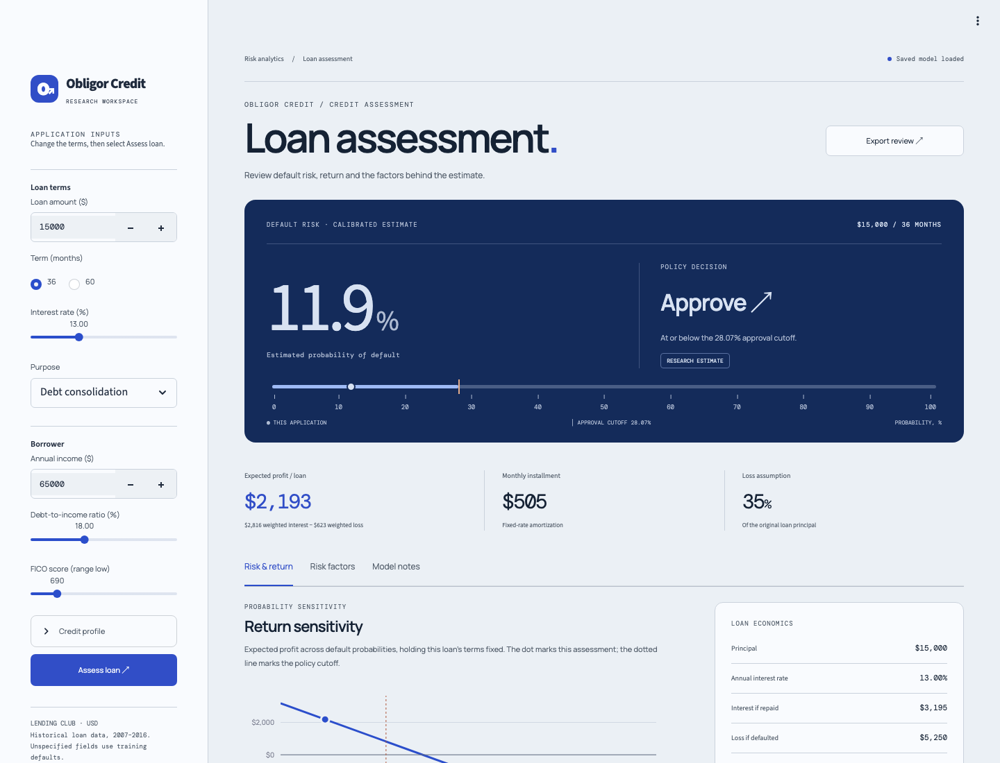
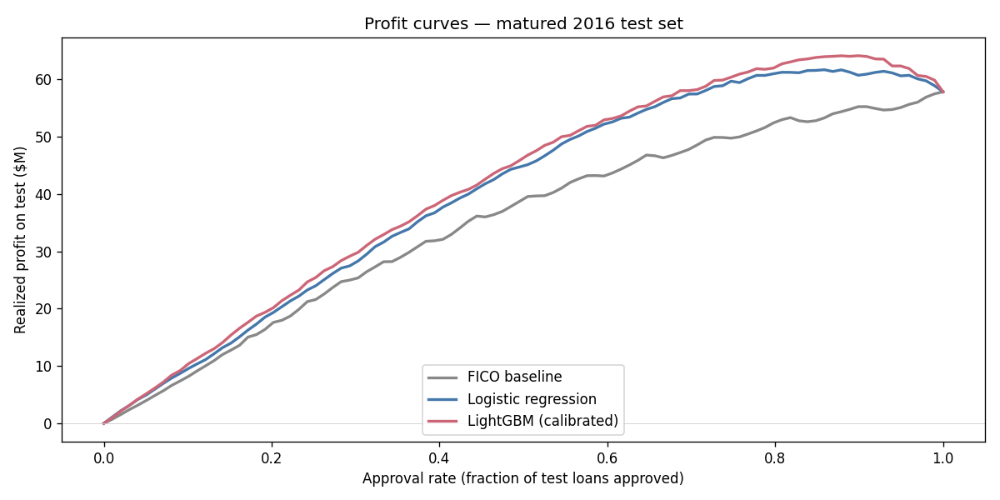

# Obligor Credit

**Credit assessment and risk-return analysis.**

Assess a loan using a saved Lending Club default model. The app calculates a calibrated
default probability, applies an approval cutoff and estimates return from the loan terms.
Feature contributions explain the raw model score.



## Project ownership

[Abhay (@immortal-coder-abhay)](https://github.com/immortal-coder-abhay) owns this project.

## Run

```bash
uv sync --frozen
uv run streamlit run dashboard/app.py --server.port 8521
```

Open **http://localhost:8521**. On macOS, LightGBM requires OpenMP (`brew install libomp`).
The model, calibrator and input defaults are included; the dashboard does not require
raw data or notebook execution.

## Use the dashboard

1. Enter the loan terms and borrower profile in the sidebar.
2. Select **Assess loan** to apply changes.
3. Review **Risk & return**, **Risk factors** and **Model notes**.
4. Select **Export review** to download the inputs and result as JSON.

The probability scale runs from 0% to 100%. The return chart varies default probability
while holding the loan terms fixed; it is a sensitivity calculation, not an observed
performance curve. Model inputs omitted from the form use saved training medians or
modes and are listed in the input table.

## Decision and return

The approval policy accepts a loan when calibrated default probability is at or below
28.07%. This cutoff was selected by maximizing realized profit on the 2016 evaluation
cohort. Because the same cohort was used to select the cutoff and report profit, those
results describe a retrospective policy comparison rather than an independent backtest.

The dashboard computes:

```text
expected profit = (1 − default probability) × interest if repaid
                  − default probability × loss if defaulted
```

Interest assumes on-schedule amortizing payments. Default loss is fixed at 35% of the
original principal. The estimate excludes funding costs, operating costs and prepayments.
The policy cutoff and this per-loan return estimate answer different questions; a declined
loan can still show positive expected profit.

## Historical results

The notebooks report the following rounded results for matured 36-month loans issued in
early 2016. These are historical cohort totals, not dashboard forecasts.

| Policy | Approval rate | Realized profit | Default rate among approved |
|---|---:|---:|---:|
| Approve all eligible loans (FICO ≥ 660) | 100% | $57.9M | 17.3% |
| Logistic regression | 86% | $61.7M | 14.2% |
| Calibrated LightGBM | 90% | $64.1M | 14.7% |



Isotonic calibration maps intervals of raw scores to a single probability. Small input
changes can therefore leave the displayed default probability unchanged. SHAP contributions
are measured in raw model log-odds, before calibration.

## Data and analysis

Source: [Lending Club loan data](https://www.kaggle.com/datasets/wordsforthewise/lending-club),
covering issued loans from 2007–2018. Training uses approximately 691,000 matured loans
from 2007–2015. Calibration uses a held-out 2015 fold; the evaluation uses matured
36-month loans issued in early 2016.

| Notebook | Analysis |
|---|---|
| [01 · Data review](notebooks/01_eda.ipynb) | Vintage defaults, leakage checks and maturity censoring |
| [02 · Features](notebooks/02_features.ipynb) | Feature construction and temporal splits |
| [03 · Models](notebooks/03_modeling.ipynb) | Logistic regression, LightGBM and probability reliability |
| [04 · Calibration and profit](notebooks/04_calibration_profit.ipynb) | Calibration, profit curves and cutoff selection |
| [05 · Fairness and explanations](notebooks/05_fairness_explainability.ipynb) | Group approval rates and SHAP contributions |

To reproduce the study, place the source CSV at `data/raw/accepted_2007_to_2018Q4.csv`,
run `uv run jupyter lab`, and execute notebooks 01–05 in order. The notebooks regenerate
processed data and calibration artifacts. Refresh the dashboard defaults with
`uv run python dashboard/export_defaults.py` if the training features change.

## Scope

- The dataset contains approved loans only; it does not represent rejected applicants.
- The evaluation cohort covers a narrow historical period. Later regimes are untested.
- The dashboard uses a fixed loss assumption instead of a separate loss-given-default model.
- Loan grade and subgrade remain at their training defaults unless the feature snapshot changes.
- The fairness analysis uses socioeconomic proxies because race and gender are unavailable.

The Streamlit entry point is `dashboard/app.py`; visual components and styles are in
`dashboard/presentation.py` and `dashboard/assets/style.css`. Fonts are bundled under
`static/fonts` with their licenses.
